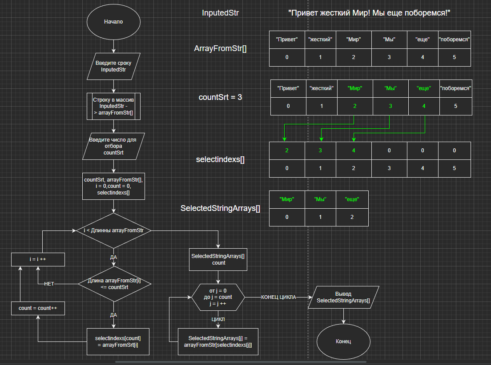

# Контрольная работа [Клименко Александра](https://github.com/Alexander77393).  [](https://git.io/typing-svg)

# [Код](https://github.com/Alexander77393/ChoiseOfSpecialization/blob/main/Code/Program.cs)


## Программа разложит введённую строку на массив из слов, а затем выведет те элементы массива, длина которых меньше или равна числу, которое будет указано далее

* Для удобства ввода изначального массива релизован ввод строки, которую программа сама разложит в массив. Разделителями при этом будут считаться знаки: пробел . , ! ; ?

``` string[] SplitStringToArray(string s)
{
    char[] separators = new char[] { ' ', '.', ',', '!', ';', '?' };
    string[] subS = s.Split(separators, StringSplitOptions.RemoveEmptyEntries);
    return subS;
}
```

* Реализован ввод числа для отбора в массиве. Также реализована проверка ввода числа. При некорректном вводе число будет запрошено повторно.


```int EnterCount(string welcomeToInput)
{
 bool inputOk = false;
 int count = 0;
 while (!inputOk)
 {
     System.Console.Write(welcomeToInput);
     string inp = Console.ReadLine()!;
     inputOk = int.TryParse(inp, out int n);
     if (inputOk)
         count = n;
     else
         System.Console.Write("Вы ввели не число. ");
 }
 return count;
}
```
* Для оптимизации было решено проводить цикл отбора через исходный массив только один раз. Во временный массив записываются нужные индексы и вычисляется нужный для искомого массива размер. Зная размер, мы можем инициировать массив и заполнить его из исходного по известным индексам.



* Пример выполнения работы:

```Программа разложит введённую строку на массив из слов, а затем выведет те элементы массива, длина которых меньше или равна числу, которое будет указано далее.
Введите строку: Привет жестокий Мир! Мы ещё поборемся!
Введите длинну строки для отбора: 3
["Привет", "жестокий", "Мир", "Мы", "ещё", "поборемся"] -> ["Мир", "Мы", "ещё"]
```